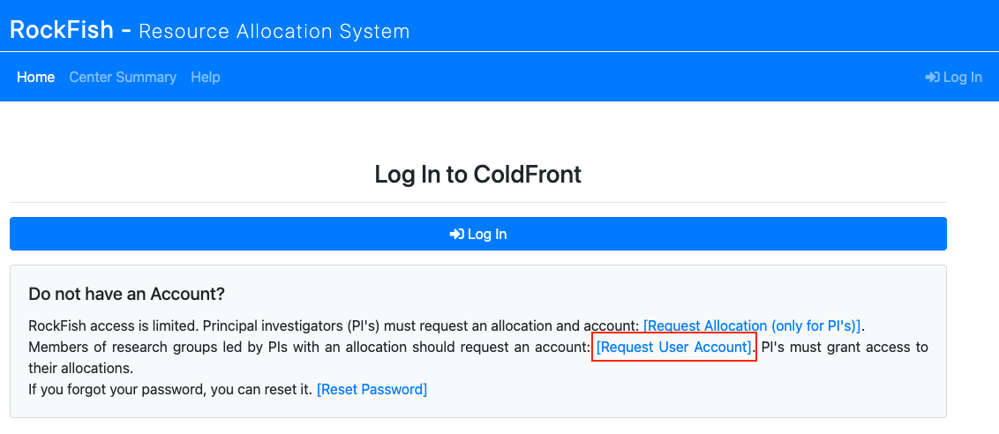
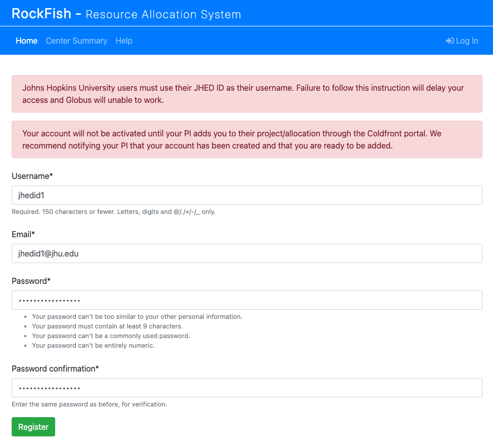
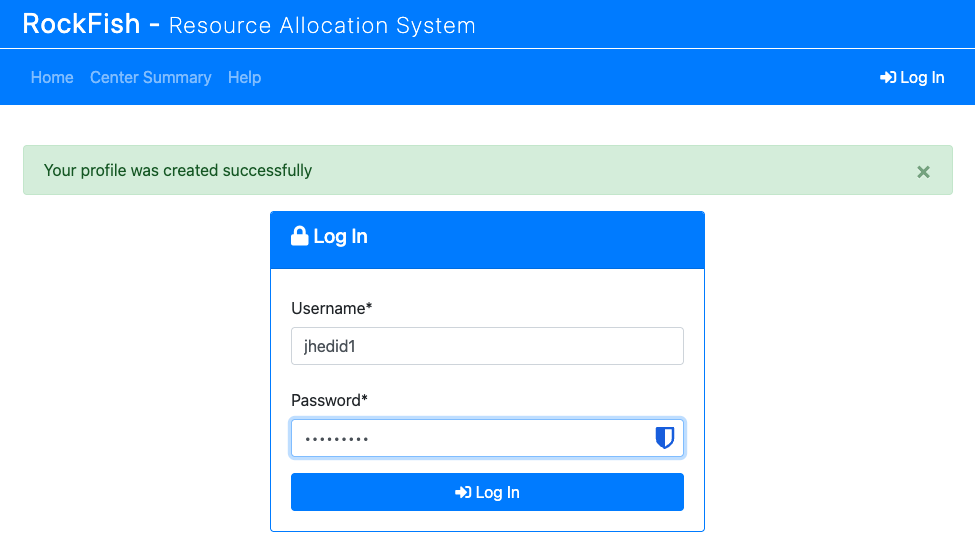

Creating a User Account
************************

.. _Coldfront Portal: https://coldfront.rockfish.jhu.edu

Non-PI users can request accounts through the Rockfish `Coldfront Portal`_. However, user accounts will only be activated after the user has been added to an existing project by a PI with an approved allocation on the Rockfish Cluster.

- All Johns Hopkins users **must use their JHED ID** (e.g., `jsmith123`) when requesting an account.  
  Failure to use your JHED ID may delay account approval and **will prevent access to Globus**, which requires JHED-based authentication.
- External 

User accounts can be requested at any time, and the portal also allows users to:

- Submit requests for user accounts
- Reset account passwords
- Monitor utilization and core-hour usage
- View current allocations and associated projects
- Add users (if PI or proxy)

.. note::
   By requesting an account on Rockfish, you are automatically subscribed to the **Rockfish Users mailing list**:  
   `rockfishusers@lists.jh.edu`.  
   This list is used to distribute **important cluster announcements, including scheduled maintenance, outages, and policy updates**.

   **Unsubscribing from this mailing list will result in account deactivation**, as it is the primary channel for operational communication.

.. note::
    All users should review the :doc:`Rockfish Citizen guidelines <../../../4_Support/Citizen>` before requesting an allocation or account.

**External and Collaborative Access**

ARCH supports interdisciplinary collaboration and allows Principal Investigators (PIs) to sponsor external users by issuing “ext-userid” accounts. These accounts are used to manage and identify non-JHU collaborators within the system.

- **External Collaborators:**  
  External users should submit account requests through the `Coldfront Portal`_, using a username **prepended with `ext-`** (e.g., `ext-jdoe`).  
  Please note that **external users will not have access to Globus** under any circumstances due to authentication restrictions.

**Getting Started**

When you first navigate to the `Coldfront Portal`_, you’ll be prompted to log in or create an account.  
Users should click **Request User Account**.

.. centered::
    |coldfront1|

You will then be asked to enter your JHED ID (as your username), email address, and a password. You **must use your JHED ID**. Using anything else will delay access and break services such as Globus. External users and collaborators **must prepend their username with `ext-`** (e.g., `ext-jdoe`).

.. centered::
    |coldfront2|

After submitting your request, you should see a confirmation message. You can then log in to the `Coldfront Portal`_ with your new credentials.

.. centered::
    |coldfront3|

At this stage, your account is created but **not yet active on Rockfish**. To gain access, you must be added to an existing project/allocation by your PI or a designated proxy. Once this has been done, your account will automatically be created on the Rockfish cluster.

