Creating a PI Account
************************

.. _Coldfront Portal: https://coldfront.rockfish.jhu.edu

Johns Hopkins Principal Investigators (PIs) may request projects and resource allocations using the `Coldfront Portal`_. Once an allocation is approved, users may request accounts. PIs or their designated proxies are responsible for adding users to the appropriate allocations once it is created.

Key features of the portal include:

- Requesting new projects and allocations (PIs)
- Managing users and adding them to allocations
- Uploading publications, grants, and ROI reports
- Assigning proxy account managers
- Monitoring usage across groups and allocations

.. warning::
   Allocations are reset quarterly under a "use it or lose it" model. Unused core-hours do not carry over.

.. note::
   By requesting an account on Rockfish, you are automatically subscribed to the **Rockfish Users mailing list**:  
   `rockfishusers@lists.jh.edu`.  
   This list is used to distribute **important cluster announcements, including scheduled maintenance, outages, and policy updates**.

   **Unsubscribing from this mailing list will result in account deactivation**, as it is the primary channel for operational communication.

.. note::
    All users should review the :doc:`Rockfish Citizen guidelines <../../../4_Support/Citizen>` before requesting an allocation or account.

**Getting Started**

When you first navigate to the `Coldfront Portal`_, you’ll be prompted to log in or create an account.  
PIs should click **Request Allocation (only for PIs)**.

.. centered::
    |coldfront1|

You will then be asked to enter your JHED ID (as your username), email address, and a password.  
**Important:** You must use your JHED ID. Using anything else will delay access and break services such as Globus.

.. centered::
    |coldfront2|

After submitting your request, you should see a confirmation message. You can then log in with your new credentials.

.. centered::
    |coldfront3|

**Upgrading to PI Status**

After logging in, you’ll land on your dashboard. To enable project and allocation creation, upgrade your account to PI:

1. Click your username in the top-right corner.  
2. Select **User Profile**.  
3. Click **Upgrade Account**.

.. centered::
    |coldfront4|  
    |coldfront5|

Once administrators approve your request, your **PI Status** will change from a red X to a green check mark.

.. centered::
    |coldfront6|

**Creating a Project**

Once PI status is approved, you can create a project:

1. From the top menu, select **Project → Add a Project**.  
2. Fill out the project form with a clear title and detailed description.

.. centered::
    |coldfront13|

In the description, include:

- Scientific or academic goals  
- The type of computations or analyses you expect to run  
- Resource requirements (cores, GPUs, storage)  
- Anticipated outcomes (e.g., publications, presentations, deliverables)  

This information helps administrators allocate resources appropriately.

.. centered::
    |coldfront7|

**Requesting a Resource Allocation**

After creating a project, open the project page and click **Request Resource Allocation**.

.. centered::
    |coldfront8|

Provide a justification for your allocation request, explaining how the resources will support your project’s goals.

.. centered::
    |coldfront9|

**Adding Users**

With a project and allocation in place, you can add users:

1. Click **Add Users** on the project page.  
2. Search by JHED ID. Users must have already created an account in the `Coldfront Portal`_ to appear.  

.. centered::
    |coldfront10|

Select the users to add. Accounts are not active on the cluster until this step is completed.  
You may also assign certain users as **Managers**, giving them rights to manage other users within the project.

.. centered::
    |coldfront11|

**Project Summary**

After adding users and requesting allocations, your project page will display active users, allocations, and other details.

.. centered::
    |coldfront12|

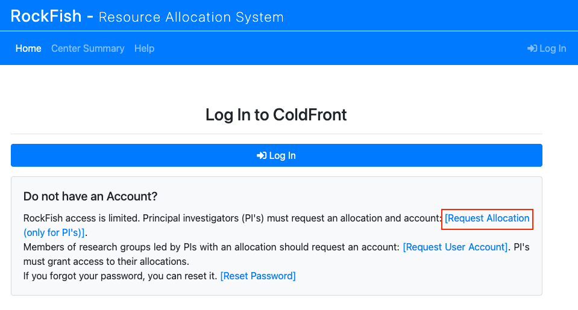

.. |coldfront2| image:: ../../../images/2_Coldfront_Create.png
   :alt: Coldfront create account form
   :width: 70 %

.. |coldfront3| image:: ../../../images/3_Coldfront_Success.png
   :alt: Coldfront success message
   :width: 70 %

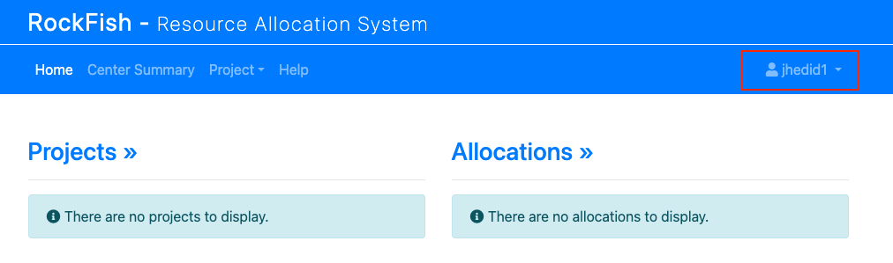

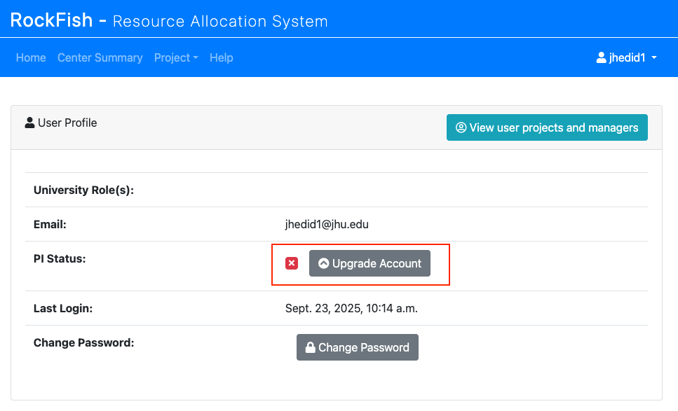

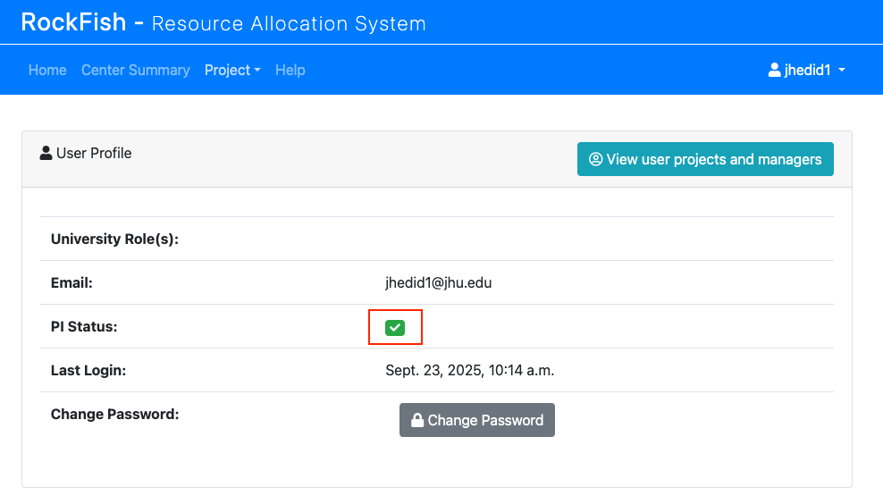

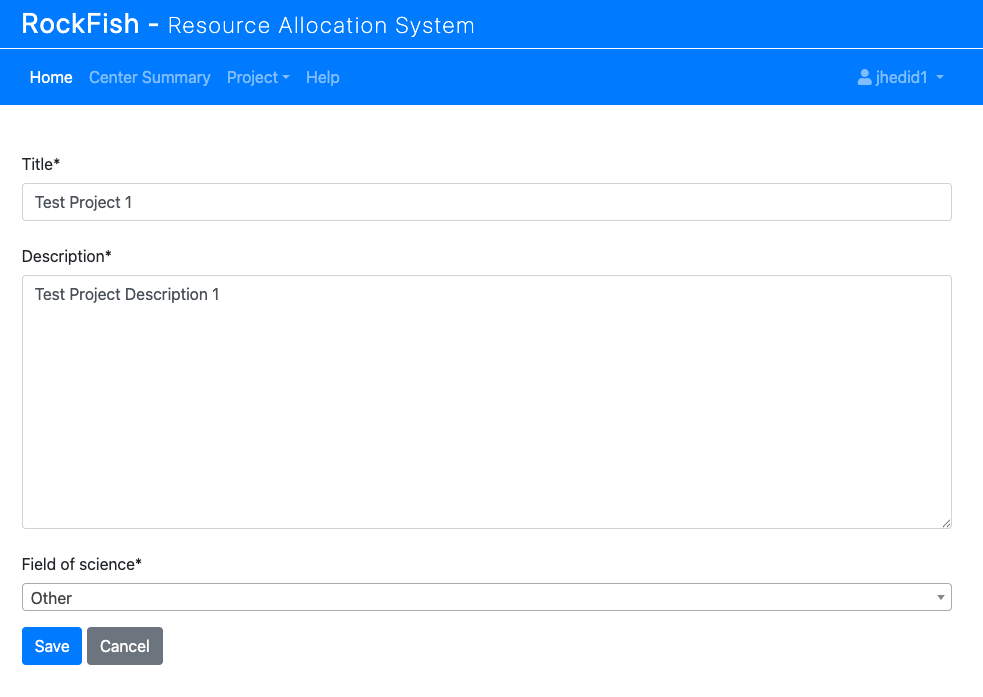

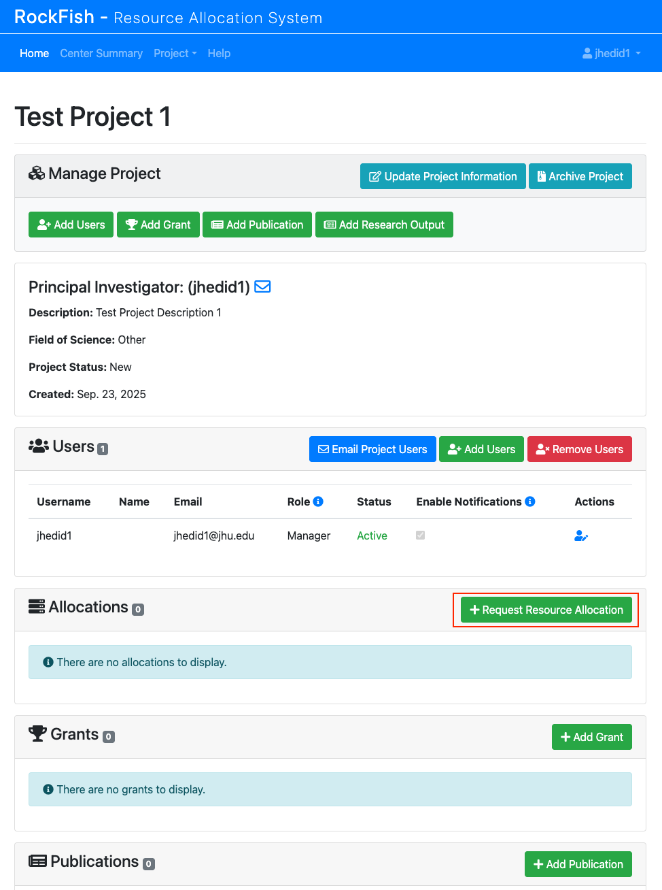

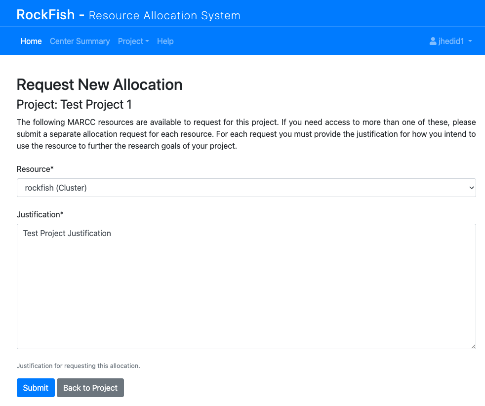

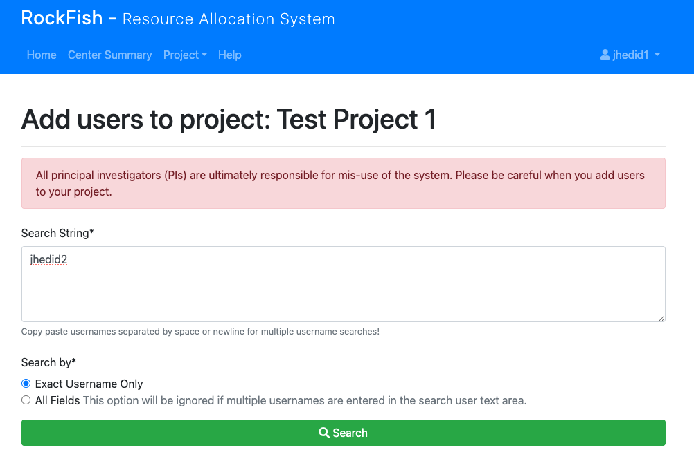

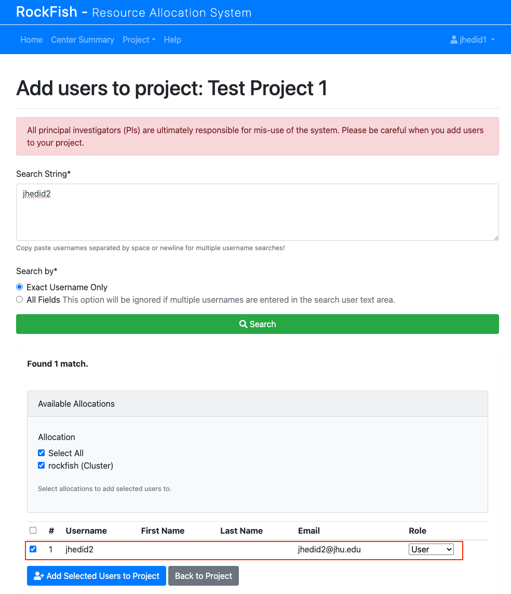

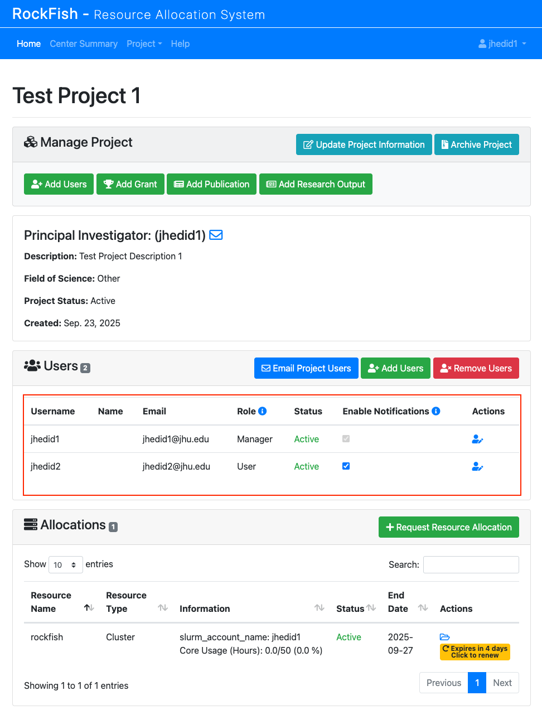

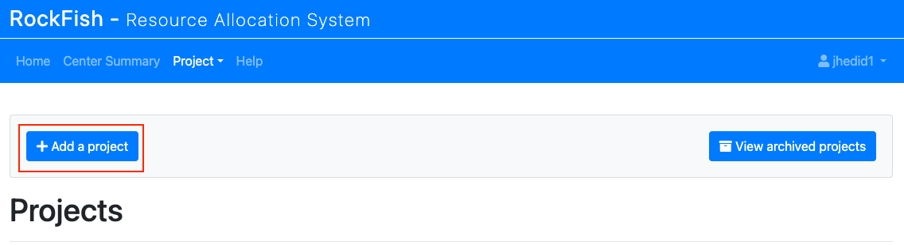