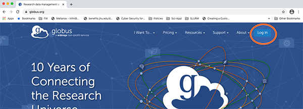
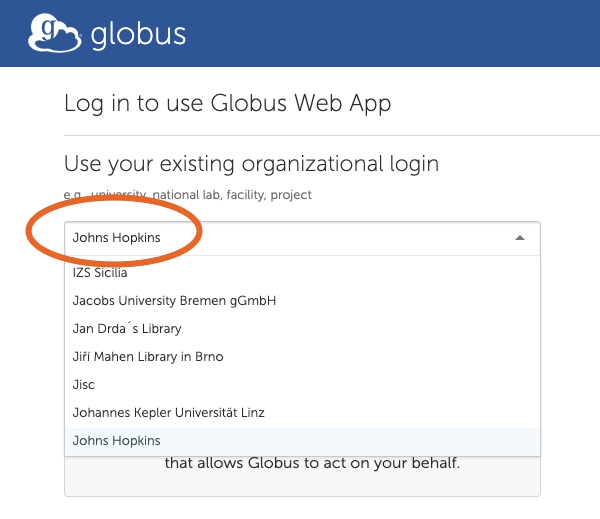
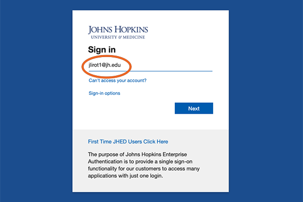
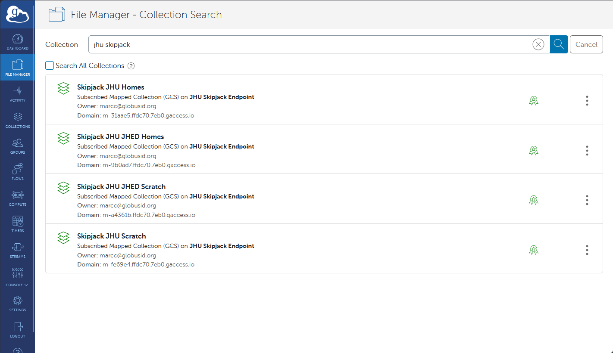
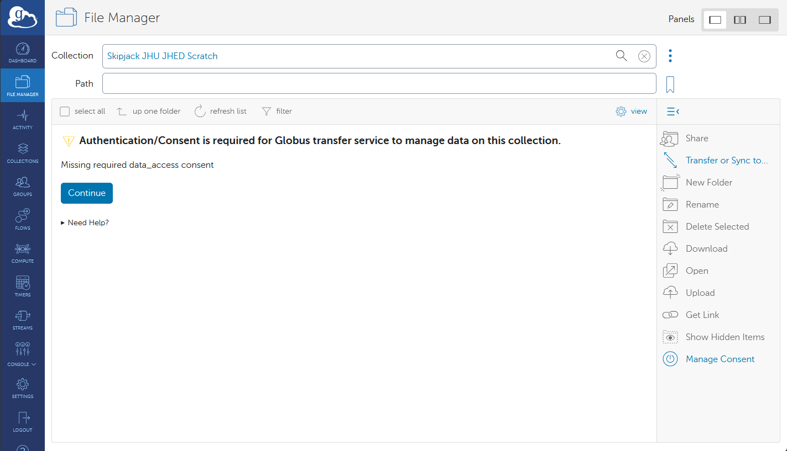
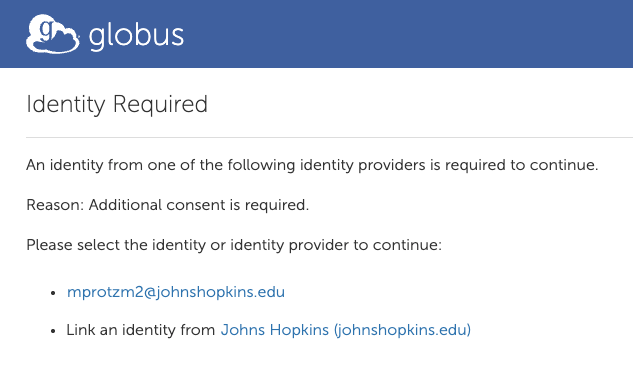
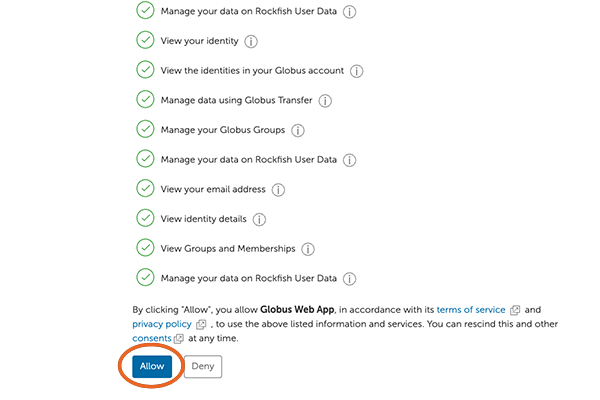
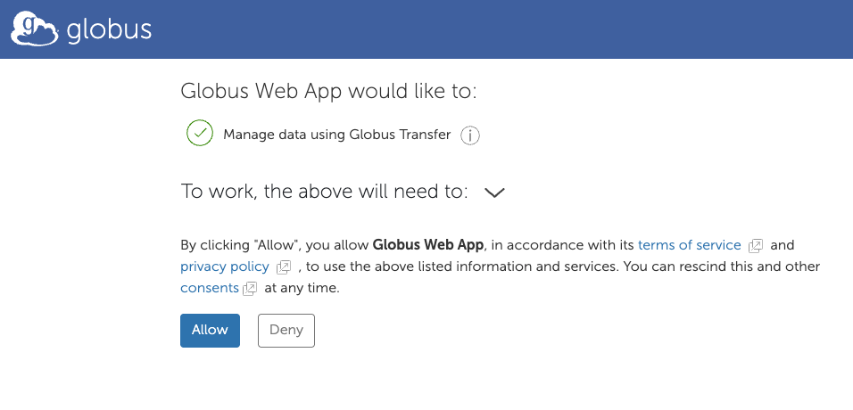
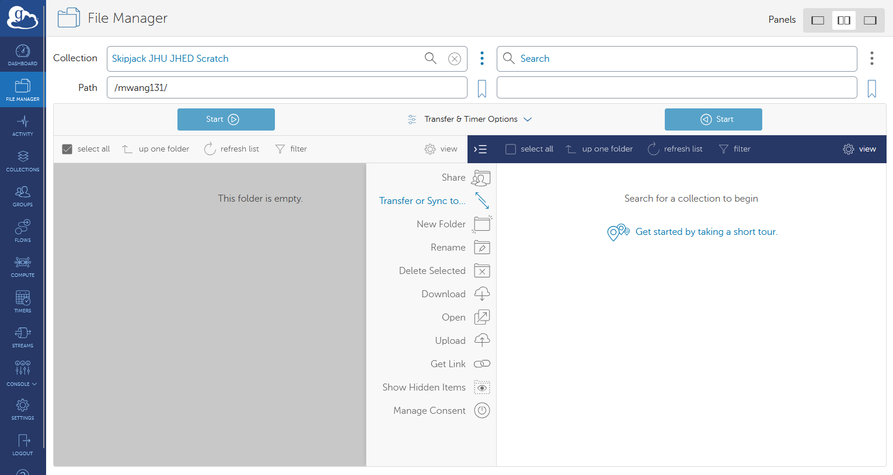

File Transfers
===========================

Data Transfer with Globus
*************************

The recommended method for transferring large data files to and from the Skipjack cluster is to use `Globus <https://www.globus.org>`_. Globus manages transfers reliably in the background, handling restarts if interruptions occur.

1. Connect to Globus
**************************

Use your browser to visit: https://www.globus.org

2. Search for Johns Hopkins
***************************

Search and select **“Johns Hopkins”** as your institution.

3. Log in with JHED ID
**************************

Use your JHED ID to log in through the Johns Hopkins SSO portal.

4. Search for the **JHU Skipjack** Collection
***********************************************

After logging in, search for the collection **"Skipjack JHU”** in the Collection Search screen. For users with a valid JHED, select either **“Skipjack JHU JHED Homes”** or **“Skipjack JHU JHED Scratch”**. For all other users, select a non-JHED option.

5. Authenticate Access
**************************

You'll be prompted to authenticate with the **“Skipjack JHU”** collection. This is required on first access or after removing the collection.

Click **“Continue”**.

6. Login using User Identity
******************************

For JHED users, select a JHED ID from the list of available identities. For non-JHED users, use your Skipjack login username.

7. Allow Access to the Globus Web App
**************************************

Scroll to the bottom and click **“Allow”** to authorize access.

8. Skipjack Endpoint
**************************

Once authorized, you will see the Skipjack endpoint connected (your HOME directory).

9. Choose a Second Endpoint
***************************

On the other side of the interface, select a second endpoint. This could be:
- A Globus Connect Personal instance (e.g., your laptop)
- An HPC system like Bridges2

10. Authentication for Second Endpoint (if needed)
**************************************************

You may be asked to authenticate to the second system. If using your own Globus Connect Personal setup, you might not need additional authentication.

11. File Manager View
**************************

You’ll now see a **split-pane interface**. The left side shows your Skipjack files. The right side shows your selected endpoint.

12. Start File Transfer
**************************

To transfer files:
- Select the folder or files on one side.
- Click **“Start”** to begin the transfer.

You can also open **“Transfer & Sync Options”** to configure behavior like sync mode or overwrite rules.
