.. _skipjack user guide:

Skipjack User Guide
===================

.. _Arch Portal: https://arch.skipjack.jhu.edu


.. contents::
   :local:
   :depth: 2


All Users
#########

**Welcome to Skipjack!**

.. admonition:: Skipjack Beta Phase and Access Notice
   :class: warning

   We are currently beta testing Skipjack in preparation for full migration!
   During this testing phase, access is temporarily limited to a select group of
   early users. Stay tuned for wider availability soon.


.. _Schmidt (SSCI):

.. admonition:: Schmidt Sciences Users
   :class: warning

   Schmidt Sciences users should reach out to Schmidt Sciences rather than refer to the
   guides below.


Requirements
------------

+----------------------------+-------------------------------------------------------+
| Item                       | Notes                                                 |
+============================+=======================================================+
| JHED Login ID              | *or* Email (External collaborators only)              |
+----------------------------+-------------------------------------------------------+
| OTP Authenticator App      | Required for Multi-Factor Authentication (MFA)        |
+----------------------------+-------------------------------------------------------+
| SSH client                 | macOS/Linux: built-in • Windows: *OpenSSH* or *PuTTY* |
+----------------------------+-------------------------------------------------------+

|
|

----

Create or Activate an Account
-----------------------------

Navigate to the Arch Portal at https://portal.arch.jhu.edu

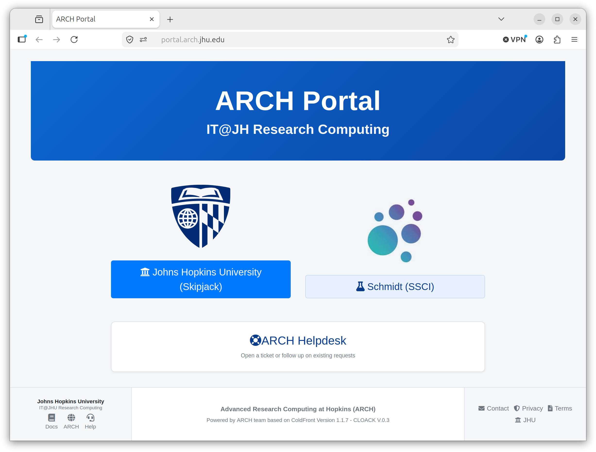

Select Affiliation and Use Case
^^^^^^^^^^^^^^^^^^^^^^^^^^^^^^^

As a multi-architecture system with a diverse user base, Skipjack requires users to determine
their access method based on both their affiliation and their specific purpose. To find the
correct procedure, please refer to the table below.

+------------------+-----------+-----------------------+-------------+-----------------------------------------+-----------------------+
| Affiliation      | Class Use | Authentication Method | MFA         | Username Prefix                         | Email Domain          |
+==================+===========+=======================+=============+=========================================+=======================+
| JHED ID          | No        | `JHU SSO`_            | Use JHU SSO | N/A                                     | jh.edu, jhu.edu, etc. |
+------------------+-----------+-----------------------+-------------+-----------------------------------------+-----------------------+
| Schmidt Sciences | No        | `Schmidt (SSCI)`_     | OTP Code    | ``ssci-``                               | A non-JHU email\*     |
+------------------+-----------+-----------------------+-------------+-----------------------------------------+-----------------------+
| External User    | No        | `Local Account`_      | OTP Code    | ``ext-``                                | A non-JHU email\*     |
+------------------+-----------+-----------------------+-------------+-----------------------------------------+-----------------------+
| JHED ID          | Yes       | `Local Account`_      | OTP Code    | ``<class-prefix>-``, e.g. ``class123-`` | A non-JHU email\*     |
+------------------+-----------+-----------------------+-------------+-----------------------------------------+-----------------------+
| External User    | Yes       | `Local Account`_      | OTP Code    | ``<class-prefix>-``, e.g. ``class123-`` | A non-JHU email\*     |
+------------------+-----------+-----------------------+-------------+-----------------------------------------+-----------------------+

\*A **non-JHU email** refers to an email address outside the JHU domain, such as ``univ.edu``, ``gmail.com``, ``hotmail.com`` etc.

.. _JHU SSO:

Log in via JHED Login ID
^^^^^^^^^^^^^^^^^^^^^^^^

Click the **JHED Login ID** button and follow the prompts.

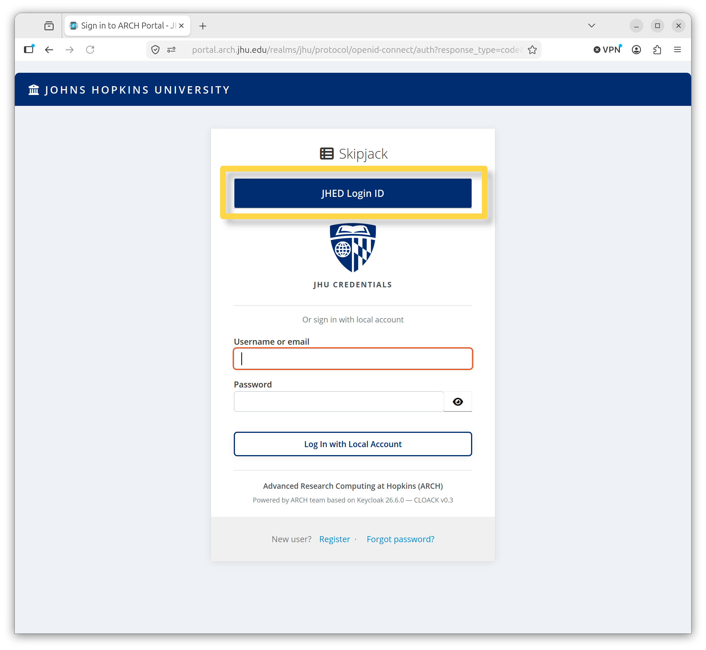

Users will be prompted with the JHED login sequence.

.. note::

   Your Skipjack username is automatically generated from your default email address
   as configured via `emailtools.tic.jh.edu/tools/alias <https://emailtools.tic.jh.edu/tools/alias>`_. For
   example:

   * ``user.name@jhu.edu`` becomes ``user.name``

   * ``uname@jhu.edu``` becomes ``uname``

   Please ensure your default email is set correctly on the portal
   *before* proceeding with your account setup.

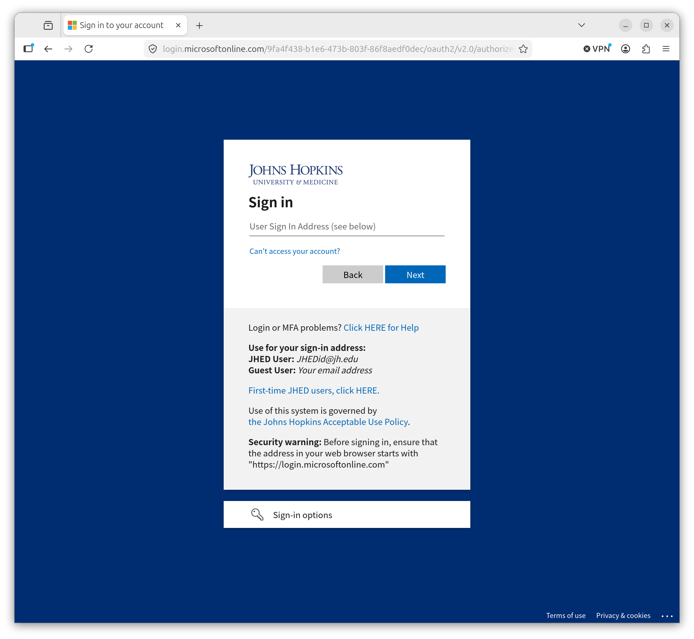

Upon first login, users will be asked to accept the Terms of Service.

.. _Local Account:

Log in via Local Account
^^^^^^^^^^^^^^^^^^^^^^^^

.. warning::

   This method is for **Schmidt Sciences, External and Class-Use users only**. JHU faculty, staff, and students
   should sign in with the JHED Login ID described above.

Schmidt Sciences users and external collaborators can create an account and log in with their email. This option
is not permitted for users with a JHED Login ID.


First Time Account Activation
"""""""""""""""""""""""""""""

Click the **Register** link, and fill out the information to create a new account.

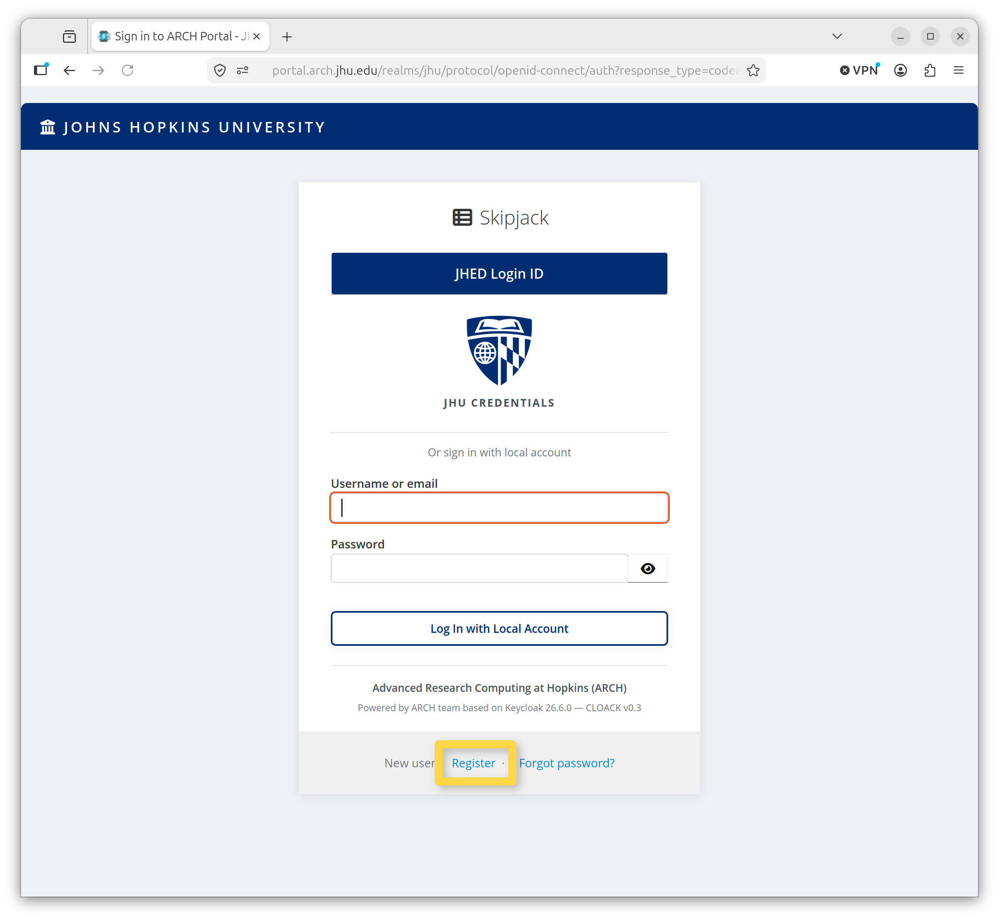

.. admonition:: Username Prefixes

   | **Schmidt Sciences** users should prepend ``scci-`` to their username.
   | **External** users should prepend ``ext-``
   | **Class** users should prepend their class code ``class-code>-`` for example ``class123-``

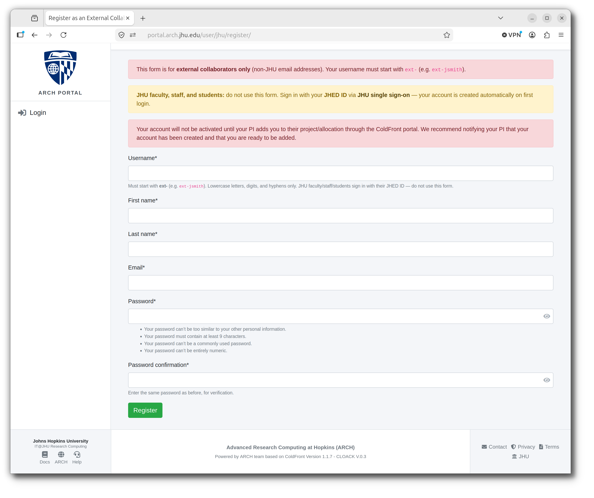

When complete, you will be returned to the login screen. Log in with
the credentials you just created.

Upon first login, users will be asked to accept the Terms of Service.


Setup Multi-Factor Identification
^^^^^^^^^^^^^^^^^^^^^^^^^^^^^^^^^

Users with a JHED ID do not need to set up a separate One-Time Password (OTP)
authenticator app. Instead, they should use their JHED ID to log in after setting
up their account in the portal (see `Create or Activate an Account`_). Conversely,
users without a JHED ID must set up an OTP authenticator app to connect to Skipjack.
To set up an OTP authenticator app for your account, follow these steps:

1. Navigate to My Profile.

   Click the dropdown menu next to the user icon and select "My Profile."

   .. image:: images/2fa-myprofile.png

2. Under **Two-Factor Auth (2FA)**, click the "Set up 2FA" button.

   .. image:: images/2fa-setup.png

3. On the next screen, find the "Set up Authenticator application" link in
   the bottom right.

   Click the **Set up Authenticator application** link.

   .. image:: images/2fa-setup-link.png

4. On the Mobile Authenticator Setup page, follow the steps to set up a
   One-Time Password (OTP) device.

   .. image:: images/2fa-mobileauth.png

   **Install one of the following:**

   **Microsoft Authenticator**

   .. image:: images/appstore.svg
      :width: 15%
      :target: https://apps.apple.com/us/app/microsoft-authenticator/id983156458
      :alt: Download it on the App Store

   .. image:: images/playstore.svg
      :width: 15%
      :target: https://play.google.com/store/apps/details?id=com.azure.authenticator
      :alt: Get it on Google Play

   |

   **FreeOTP**

   .. image:: images/appstore.svg
      :width: 15%
      :target: https://apps.apple.com/us/app/freeotp-authenticator/id872559395
      :alt: Download it on the App Store

   .. image:: images/playstore.svg
      :width: 15%
      :target: https://play.google.com/store/apps/details?id=org.fedorahosted.freeotp
      :alt: Get it on Google Play

   |

   **Google Authenticator**

   .. image:: images/appstore.svg
      :width: 15%
      :target: https://apps.apple.com/us/app/google-authenticator/id388497605
      :alt: Download it on the App Store

   .. image:: images/playstore.svg
      :width: 15%
      :target: https://play.google.com/store/apps/details?id=com.google.android.apps.authenticator2
      :alt: Get it on Google Play

   |

   Using your chosen authenticator app, scan the barcode. Enter the 6-digit code in the
   box to confirm synchronization.

   Optionally, you can give the device a name for easier record-keeping.

   Click **Submit** before the 6-digit code expires to validate the setup.


|
|

----

Reset Password
--------------

JHED ID Users
^^^^^^^^^^^^^

JHED ID users should manage passwords through `<my.jh.edu>`_.
You can reset your password by clicking the link in top right of the MyJHU webpage.


Schmidt Sciences and External Users
^^^^^^^^^^^^^^^^^^^^^^^^^^^^^^^^^^^

If you forgot your password and cannot log in to the ARCH Portal, you can
send yourself a password reset email.

.. warning::

   Users added as part of a class cannot reset their password using this method. Instead,
   please reach out to `help@arch.jhu.edu <mailto:help@arch.jhu.edu>`_.


1. From the login screen, click the "Forgot Password" link.

   .. image:: images/frgpw-link.png

2. Enter your email address.

   JHU users should enter their JHU email address. External users can
   enter the email address used to set up their external account.

   Click **Send Reset Email**.

   .. image:: images/frgpw-email.png

A confirmation screen will appear, indicating that a password reset email has been sent.

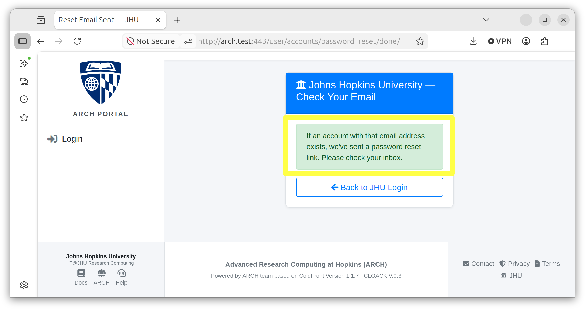


|
|

----

Connect to the Skipjack Cluster
-------------------------------


**Schmidt Sciences Users** can access Skipjack using any one of the three login nodes.

.. code-block:: bash

   ssh <YourUserID>@login03.schmidtsciences.jhu.edu
   ssh <YourUserID>@login04.schmidtsciences.jhu.edu
   ssh <YourUserID>@login05.schmidtsciences.jhu.edu

**JHED ID and External Users** can connect to any one of the three login nodes.

.. code-block:: bash

   ssh <YourUserID>@login03.arch.jhu.edu
   ssh <YourUserID>@login04.arch.jhu.edu
   ssh <YourUserID>@login05.arch.jhu.edu


.. note::

   Multi-Factor Authentication is required to log in to Skipjack.


Select the process for connecting to the system based on your affiliation and purpose.

+------------------+-----------+-----------------------+----------------+-----------------------------------------+-----------------------+
| Affiliation      | Class Use | Authentication Method | MFA            | Username Prefix                         | Email Domain          |
+==================+===========+=======================+================+=========================================+=======================+
| JHED ID          | No        | JHU SSO               | `Use JHU SSO`_ | N/A                                     | jh.edu, jhu.edu, etc. |
+------------------+-----------+-----------------------+----------------+-----------------------------------------+-----------------------+
| Schmidt Sciences | No        | Schmidt (SSCI)        | `OTP Code`_    | ``ssci-``                               | A non-JHU email\*     |
+------------------+-----------+-----------------------+----------------+-----------------------------------------+-----------------------+
| External User    | No        | Local Account         | `OTP Code`_    | ``ext-``                                | A non-JHU email\*     |
+------------------+-----------+-----------------------+----------------+-----------------------------------------+-----------------------+
| JHED ID          | Yes       | Local Account         | `OTP Code`_    | ``<class-prefix>-``, e.g. ``class123-`` | A non-JHU email\*     |
+------------------+-----------+-----------------------+----------------+-----------------------------------------+-----------------------+
| External User    | Yes       | Local Account         | `OTP Code`_    | ``<class-prefix>-``, e.g. ``class123-`` | A non-JHU email\*     |
+------------------+-----------+-----------------------+----------------+-----------------------------------------+-----------------------+

\*A **non-JHU email** refers to an email address outside the JHU domain, such as ``univ.edu``, ``gmail.com``, ``hotmail.com`` etc.


.. _Use JHU SSO:

JHED ID Users
^^^^^^^^^^^^^

Users with JHED ID will be prompted to approve the login via web browser with JHU SSO. Follow the
provided hyperlink to review the request. After authenticating in the browser
return to the terminal command line and press ``Enter`` to proceed.


.. _OTP Code:

Schmidt Sciences, External and Class-Use Users
^^^^^^^^^^^^^^^^^^^^^^^^^^^^^^^^^^^^^^^^^^^^^^

After entering your password, you will be prompted for
your OTP code (see `Setup Multi-Factor Identification`_ for more information).
Enter the code from your OTP app that corresponds to your Skipjack account.

.. note::

   If it is your first time connecting, you'll be asked to verify the host key.
   Once verified, type **yes** at the prompt, then enter your Skipjack password.

|
|

----

.. _data transfer with globus:

Data Transfer with Globus
-------------------------

We recommend using Globus to transfer large amounts of data to and from the Skipjack
cluster. Globus reliably manages transfers in the background, handling restarts
if interruptions occur.

The directions below explain how to transfer files from an external endpoint to
the Skipjack cluster scratch storage. Transferring files from Skipjack to an external endpoint
can be done by reversing the endpoints or changing the transfer direction.

.. note::

   **Endpoints** can be other HPC systems registered on Globus, or personal computers and laptops set up
   with a `Globus Connect Personal Instance <https://www.globus.org/globus-connect-personal>`_.

1. Connect to Globus
^^^^^^^^^^^^^^^^^^^^

Using your web browser, navigate to `<https://www.globus.org>`_.

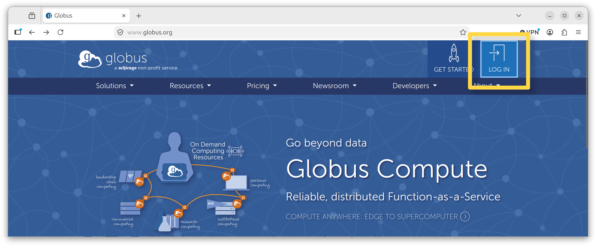

2. Select Johns Hopkins
^^^^^^^^^^^^^^^^^^^^^^^

Select **Johns Hopkins** from the dropdown menu.

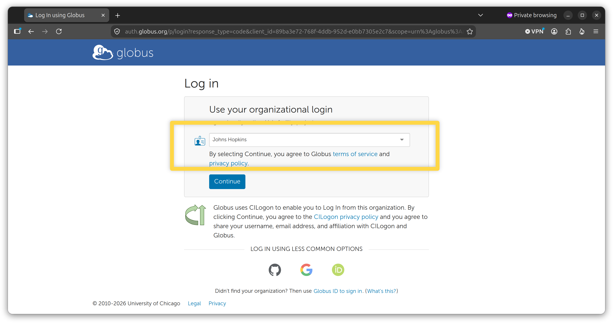

3. Log in with JHED ID
^^^^^^^^^^^^^^^^^^^^^^

Authenticate via the Johns Hopkins SSO portal using your JHED ID.

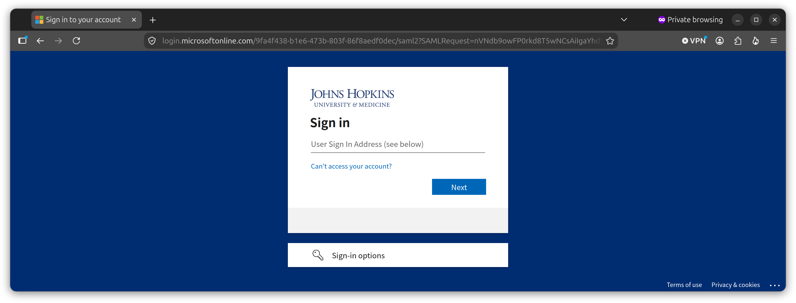


4. Set the Source Endpoint Files
^^^^^^^^^^^^^^^^^^^^^^^^^^^^^^^^

After logging in, select **File Manager** on the left. Use the search bar to find your
desired endpoint, then select the folders or files you wish to transfer.

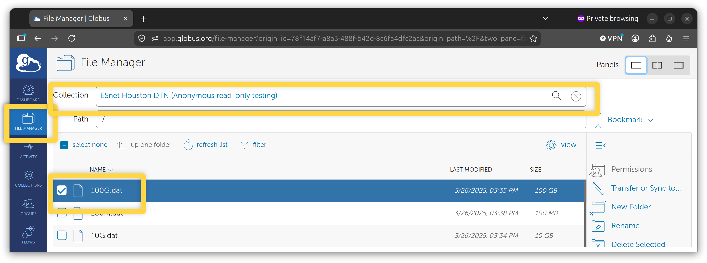

This example uses a publicly available test data set from ESNet.

.. note::

   You may need to authenticate the endpoint to grant Globus permission to access your files.


5. Set the Skipjack Destination Endpoint
^^^^^^^^^^^^^^^^^^^^^^^^^^^^^^^^^^^^^^^^

Click the two-panel icon in the top right of the **File Manager** to split the view.
In the new search bar on the second panel, search for **Skipjack**.

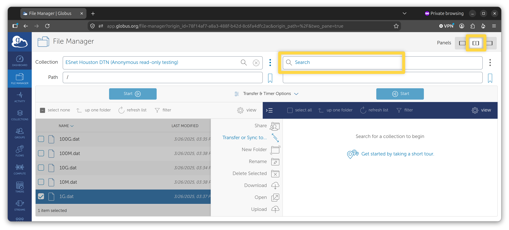

There are several Skipjack endpoints available:

   +---------------------------+
   | **Skipjack JHU Homes**    |
   +---------------------------+
   | **Skipjack JHU Scratch**  |
   +---------------------------+
   | **Skipjack SSCI Scratch** |
   +---------------------------+

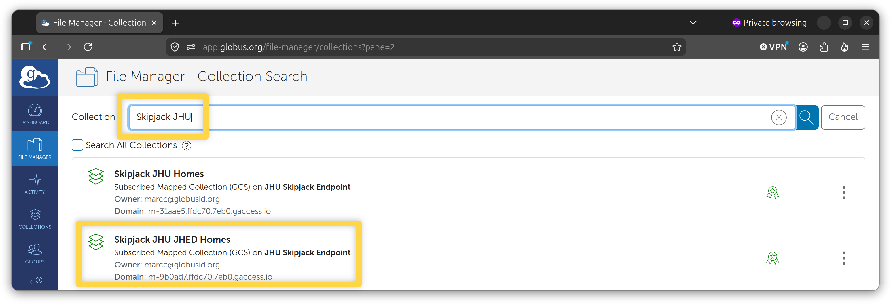


Click the name hyperlink of the desired Skipjack endpoint to set it as your transfer destination.

|

**Authenticate to Allow Access**

On first access, Globus will ask for consent to access your data. At the prompt, click **Continue**.

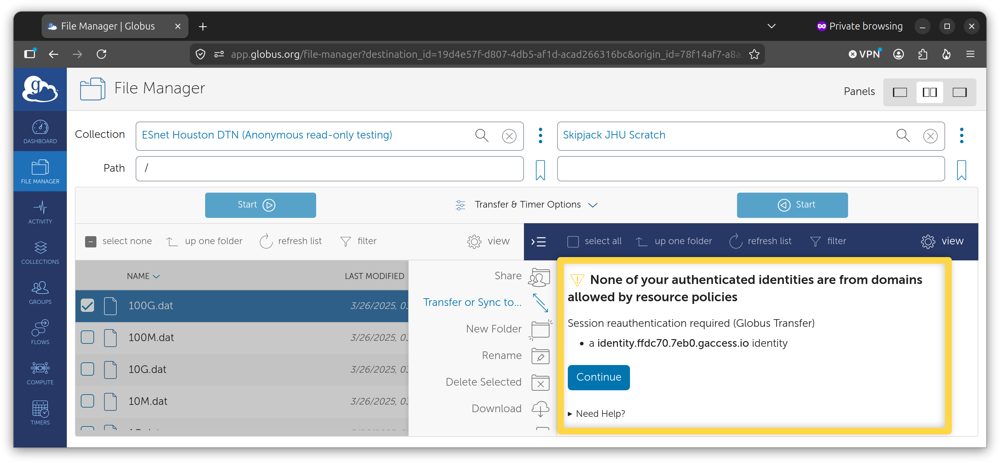

Follow the link **JHU Skipjack OIDC Server**.

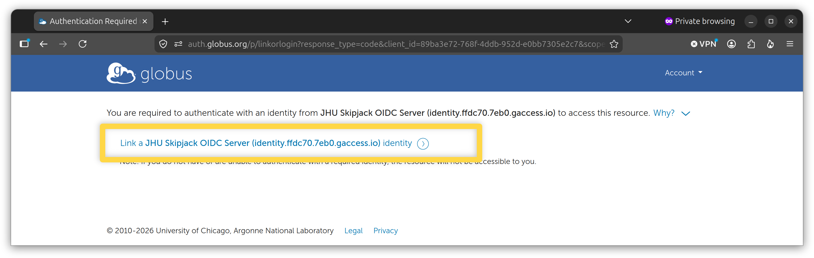

At the prompt, enter your Skipjack username and password (the same SSH credentials used to `Connect to the Skipjack Cluster`_).

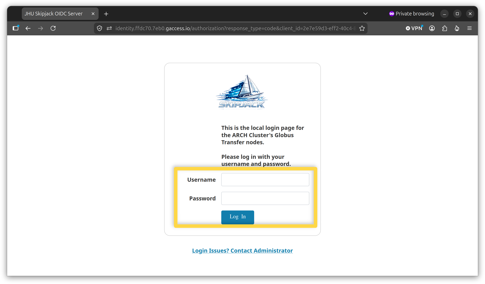

If prompted, log in to your primary identity, click **Continue** and follow the on-screen
prompts to authenticate with your JHED ID.

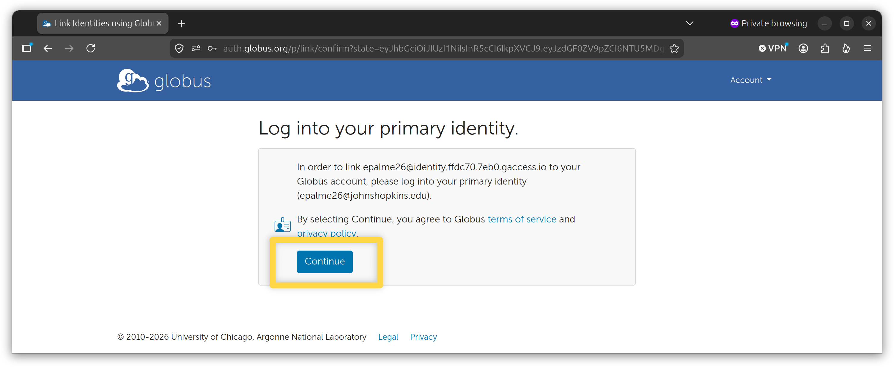

**Allow Globus Web App**

Click **Allow** to allow the Globus Web App to manage your data on Skipjack.

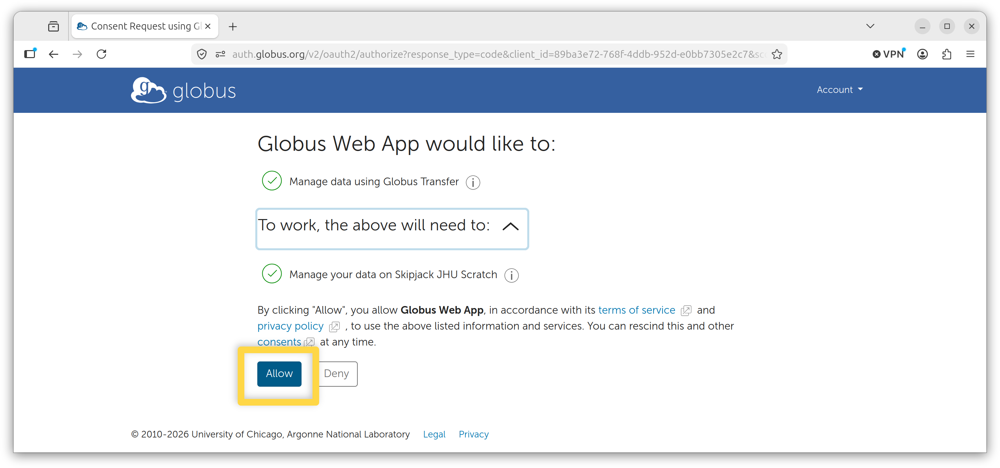

For subsequent file transfers, your permission will be stored.

|

After allowing access, you will return to the **File Manager** view. Confirm the endpoints,
target directories, and selected files before proceeding.

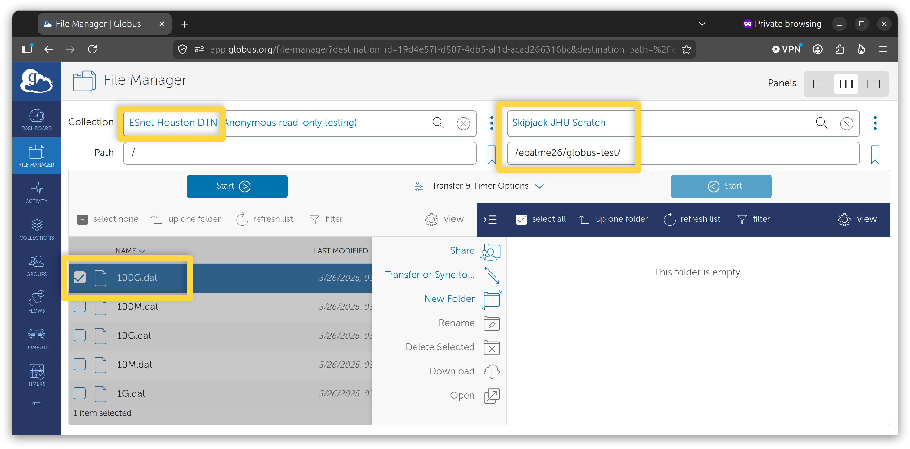

6. Start File Transfer
^^^^^^^^^^^^^^^^^^^^^^

To transfer files from the endpoint on the left panel, to the endpoint on the right panel, click
the **Start** button in the left panel with the right-pointing arrow.

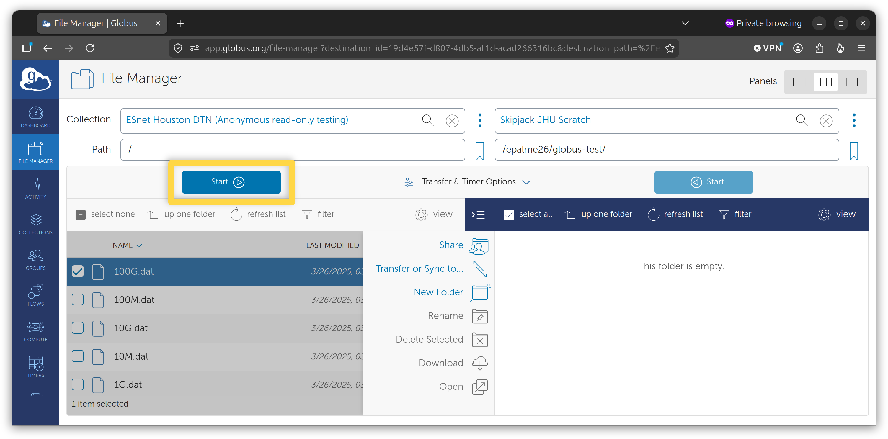

.. note::

   You can transfer files in the opposite direction by selecting files on the right
   and clicking the **Start** button in the right panel with the left-pointing arrow.

|

You can monitor, manage and confirm transfer activity under the **Activity** tab.

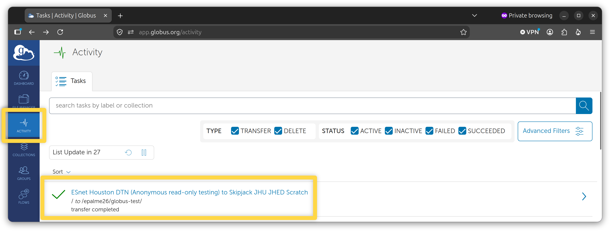

.. note::

   For more file transfer behavior options, click **Transfer & Sync Options** located in the middle column
   between the two **File Manager** panels.

|
|

----


Running VSCode on Skipjack
--------------------------

For details on responsibility running VSCode on the Skipjack cluster, please see
:doc:`vscode`.

|
|

----

Support
-------

For support, Schmidt Sciences users should email help@schmidtsciences.jhu.edu.

All other users, please email help@arch.jhu.edu.

|
|

----


Principal Investigators
#######################

Request Account Upgrade to PI
-----------------------------

.. note::

   This section is for Principal Investigators actively conducting research
   with Skipjack.

Principal Investigators (PI) on Skipjack can request to have their account upgraded to PI status.
Requests are reviewed by staff.
When an account is upgraded from User to PI, a default project is created and associated with
the requesting PI.

To request an account upgrade to PI:

1. In the Arch Portal, click on the dropdown menu in the upper right next to the username and icon. Select
   **My Profile**.

   .. image:: images/pi-upgrade-myprof.png

2. Click on the grey **Upgrade Account** button.

   .. image:: images/pi-upgrade-upgrade-button.png

3. Select a department from the dropdown menu and click **Submit Upgrade Request**.
   If your department is not listed, please contact `help@arch.jhu.edu <mailto:help@arch.jhu.edu>`_
   to have it added.

   .. image:: images/pi-upgrade-department.png

4. Once the request is submitted, a confirmation banner will appear at the top of the page.

   .. image:: images/pi-upgrade-banner.png

When a request is made, a notification is sent to staff to review. Your request
will remain in the pending state until it is approved.


|
|

----


Add a Cost Center
-----------------

.. admonition:: Regarding Cost
   :class: note

   Moving to Skipjack does not trigger any immediate billing changes. Free
   compute access will remain available for now. Please be assured that there
   will be no billing without substantial prior communication, and there will
   never be any form of retroactive billing to users.


.. note::

   Only PIs can add a cost center.


1. In the left navigation pane, select **Cost Centers**.

   .. image:: images/cost-center-nav.png

2. Fill out the required information and click "+ Add."

   .. image:: images/cost-center-info.png

   A confirmation banner will appear.

   .. image:: images/cost-center-conf.png

|
|

----


Create a Project
----------------

.. note::

   PIs are automatically assigned a default project and allocation when their account status is
   upgraded from user to PI. Use the steps below to create additional projects.


.. note::

   Only PIs can create a project.

Before starting, if you are creating a JHU-affiliated project, you need
to first create a Cost Center (see `Add a Cost Center`_ above).

1. In the left navigation pane, select Projects -> My Projects

   .. image:: images/sel-add-proj.png

   To start the process, click **+ Add a project**.

2. Fill in the required information.

   .. image:: images/new-proj-fill1.png

3. Click **Save** to submit the project.

   .. image:: images/new-proj-fill2.png

4. Once the new project is created, you will be prompted to review the project.

   Click the link to initiate the review.

   .. image:: images/review-proj.png

   Once your review is complete, check the acknowledgement box and click **Submit**.

   .. image:: images/review-proj-sub.png

Once complete, a "Project reviewed successfully" banner will appear.

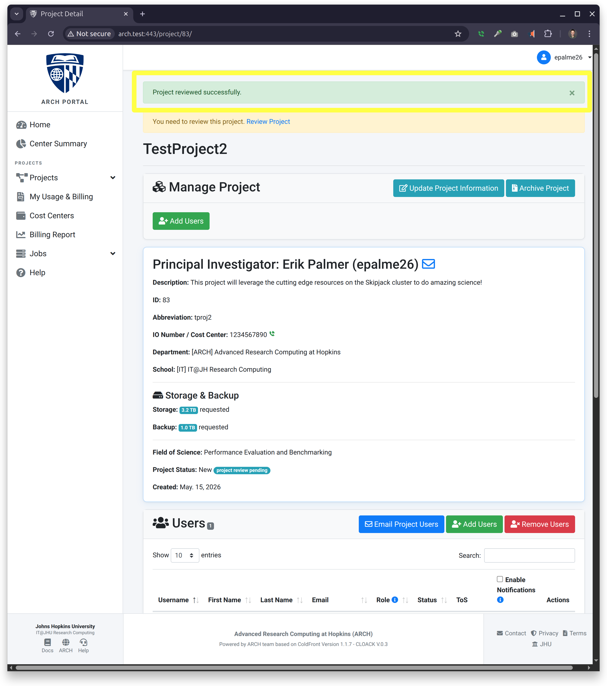

At this point, the project needs to be reviewed and approved by a staff user before
an allocation can be requested.

|
|

----


Create an Allocation
--------------------

.. note::

   This section is for PIs with an approved project.

Once a project is approved, a resource allocation for time on the cluster can be requested.

1. From the portal home screen, navigate to the project for which to request an allocation.
   You can follow Projects -> My Projects. Then select the project from the table by clicking
   on the number hyperlink.

   .. image:: images/allow-nav-to-proj.png

2. Once on the Project page, scroll down and click **+ Request Resource Allocation**.

   .. image:: images/allow-scrolldown.png

   .. image:: images/allow-request-button.png

3. Fill out the required information and click **Submit**.

   .. image:: images/allow-form.png

A banner at the top of the page will confirm your request has been sent.

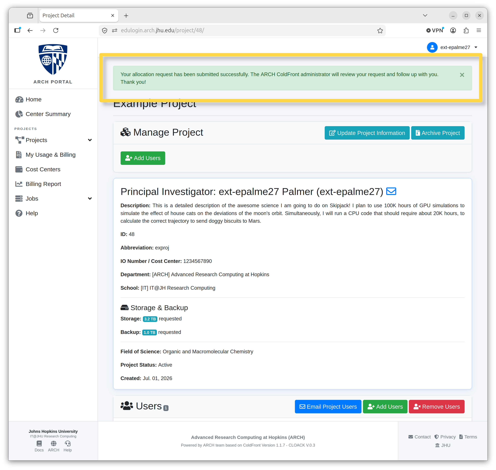

|
|

----


Add Users to a Project or Allocation
------------------------------------

.. note::

   Only PIs and managers of the same project can add users.

1. Navigate to the project.

   Select the project you wish to add users to by clicking on the name hyperlink.

   .. image:: images/add-user-sel-proj.png

2. Press the green **Add Users** button under Manage Project.

   .. image:: images/add-user-button.png

3. Enter the username in the Search String field.

   .. image:: images/add-user-search-add.png

   Click the green *Search* button to populate the found matches list.
   When the user is found, click the checkbox next to their username.
   Then click **Add Selected Users to Project** to add the user to the project.

The banner at the top will confirm the user has been added.

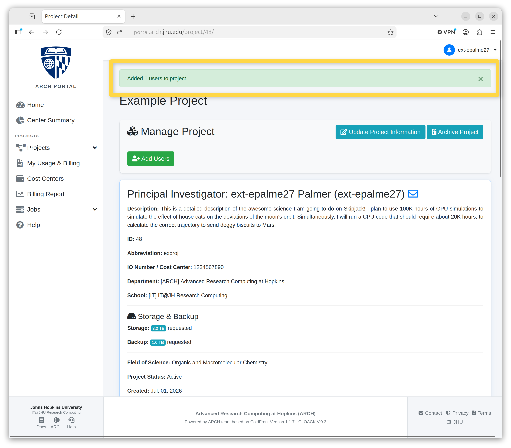


|
|

----

.. _assign proxy account managers:

Assign Proxy Account Managers
-----------------------------

.. note::

   Only PIs can assign a user to manage a project they own.

1. From the project page locate the Users table.

2. Select the user whose role you want to change and click the person icon under **Actions**.

   .. image:: images/proj-user-role-action.png

3. On the Project User Detail page, select the Manager role from the dropdown menu.

   .. image:: images/proj-user-role-dropdown.png

4. Click the **Update** button and note the green banner at the top of the screen confirming the
change.

   .. image:: images/proj-user-role-confirm.png


Frequently Asked Questions
##########################

Please see :doc:`migration-to-skipjack` for frequently asked questions regarding the migration
to Skipjack
