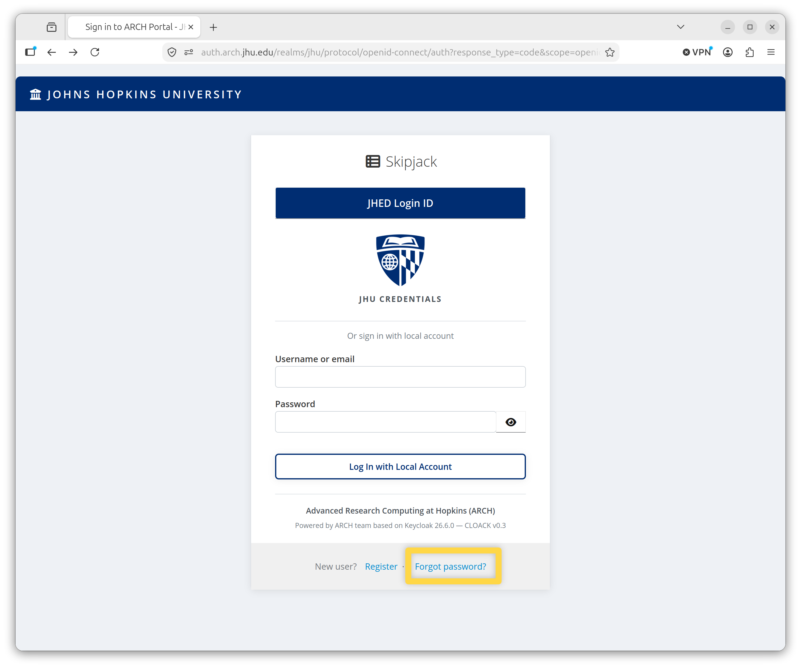
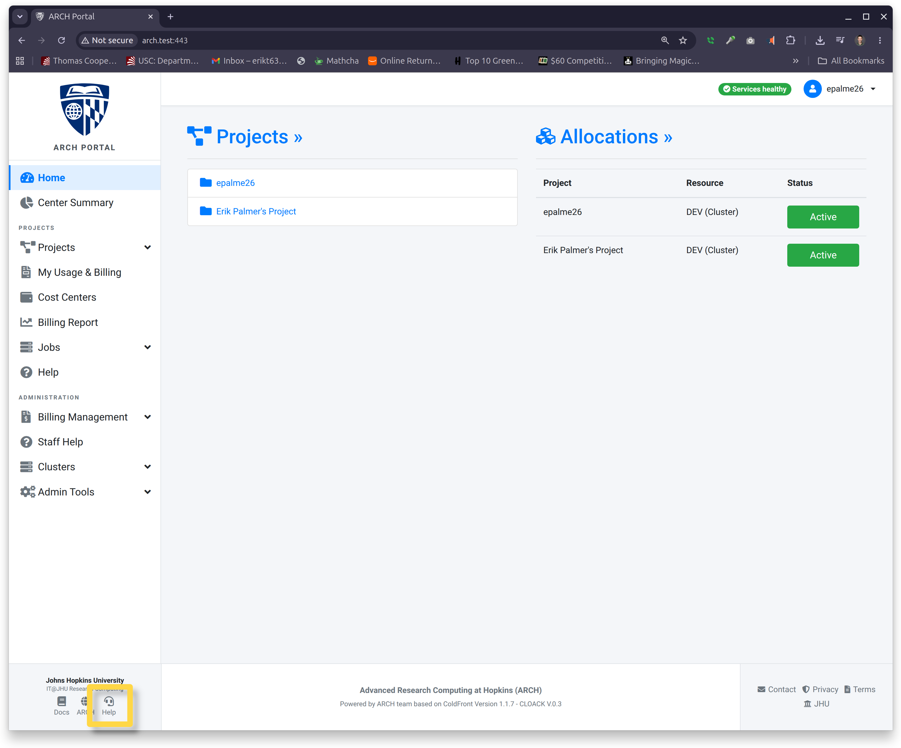
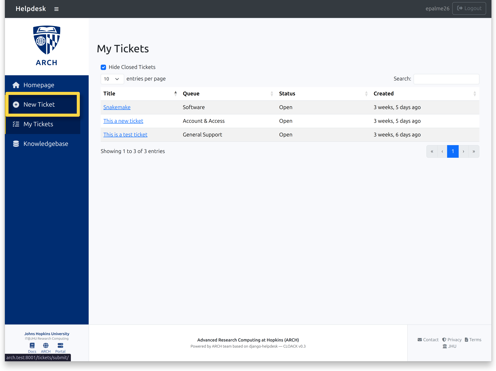
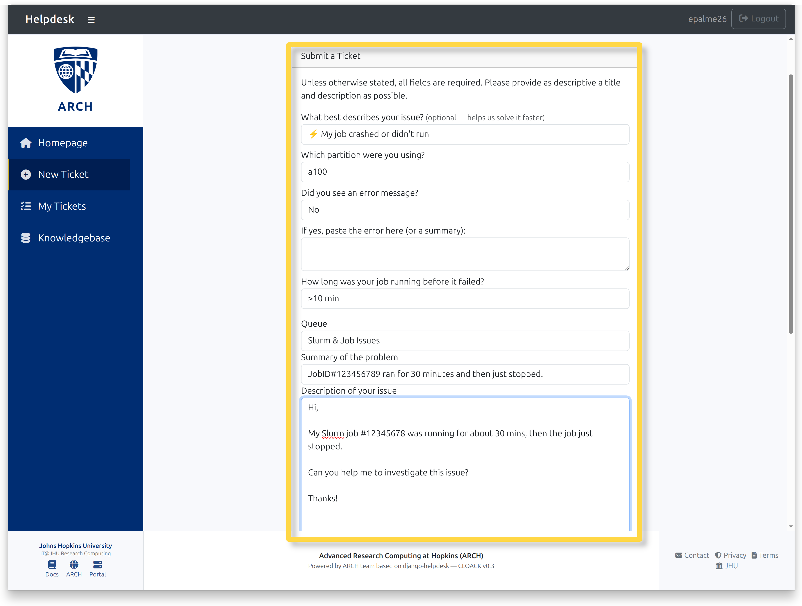
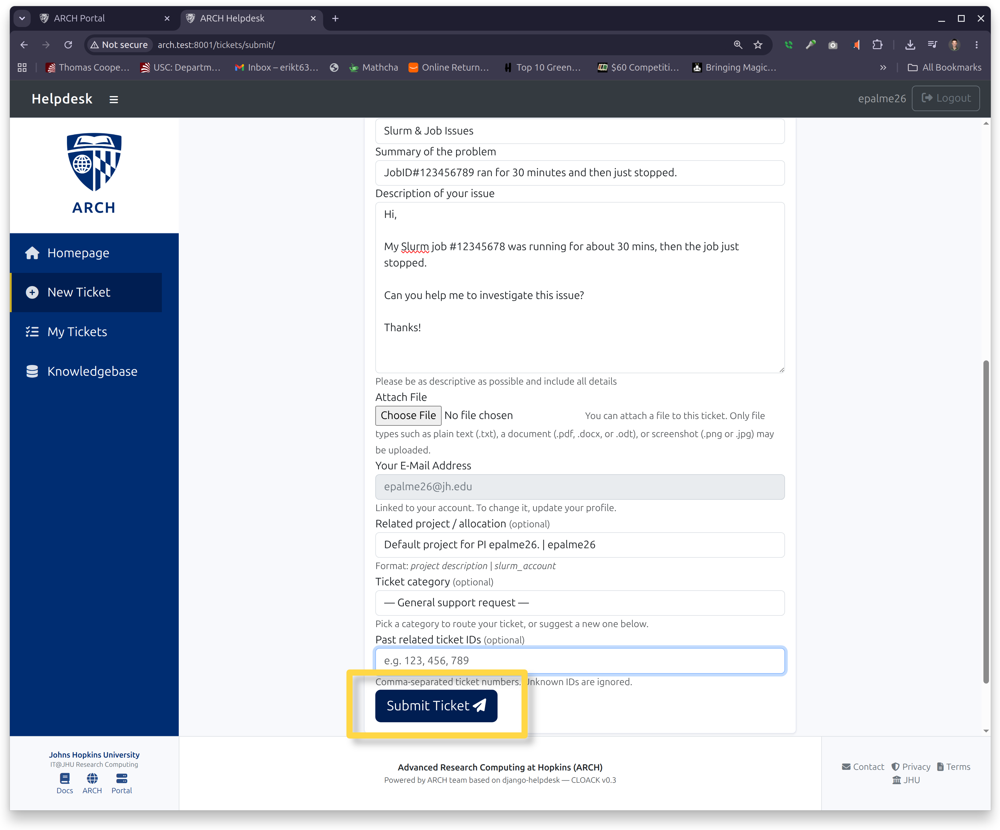
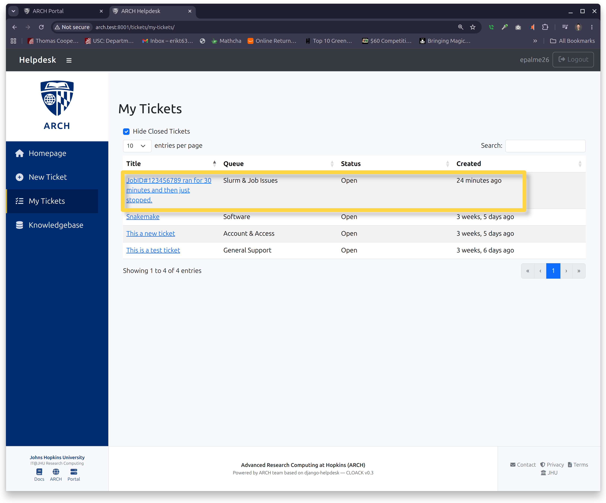

Skipjack User Guide
===================

.. _Arch Portal: https://arch.skipjack.jhu.edu

.. contents::
   :local:
   :depth: 2

All Users
#########

**Welcome to Skipjack!**

Requirements
------------

+----------------------------+-------------------------------------------------------+
| Item                       | Notes                                                 |
+============================+=======================================================+
| JHED Login ID              | *or* Email (External collaborators only)              |
+----------------------------+-------------------------------------------------------+
| OTP Server App             | Required for Multi-Factor identification              |
+----------------------------+-------------------------------------------------------+
| Hopkins VPN (Pulse Secure) | Required for off-campus access of some services       |
+----------------------------+-------------------------------------------------------+
| SSH client                 | macOS/Linux: built-in • Windows: *OpenSSH* or *PuTTY* |
+----------------------------+-------------------------------------------------------+

|
|

Create or Activate an Account
-----------------------------

Navigate to the Arch Portal at https://arch.skipjack.jhu.edu

.. image:: images/portal-landing.png

Schmidt users should select the **Schmidt (SCCI)** button. All other users, select
**Johns Hopkins University (Skipjack)**.

There are two login methods: **JHED Login ID** and **Local Account**.

Via JHED Login ID
^^^^^^^^^^^^^^^^^

Click the **JHED Login ID** button and follow the prompts.

.. image:: images/jhed-login2.png

Users will be prompted with JHED login sequence.

.. image:: images/jhed-login-msid.png

Upon first login, users will be asked to accept the Terms of Service.

Via Local Account
^^^^^^^^^^^^^^^^^

.. warning::

   This method is for **external collaborators and Schmidt users only**. JHU faculty, staff and students
   should sign in with the JHED Login ID described above.

Schmidt users and external collaborators can create an account and login with their email. This option
is not permitted for users with a JHED Login ID.

First Time
""""""""""

Click the **Register** link, and fill out the information to create a new account.

.. image:: images/register2.png

.. note::

   Schmidt users should prepend "scci-" to their username. External collaborators should prepend "ext-"

.. image:: images/register-form.png

When complete, you will be returned to the login screen. Login with
the credentials you just created.

Upon first login, users will be asked to accept the Terms of Service.

Setup Multifactor Identification
^^^^^^^^^^^^^^^^^^^^^^^^^^^^^^^^

All users will need a One-Time Password (OTP) to connect to Skipjack. To set up
an OTP server app for your account follow the steps:

1. Navigate to My Profile.

    Click on the drop-down menu next to the user icon and select "My Profile."

    .. image:: images/2fa-myprofile.png

2. Under **Two-Factor Auth (2FA)**, click the "Set up 2FA" button.

    .. image:: images/2fa-setup.png

3. On the next screen, find the link, "Set up Authenticator application" on
   the bottom right.

    Click the Set up Authenticator application link.

    .. image:: images/2fa-setup-link.png

4. On the Mobile Authenticator Setup page, follow the steps to set up a
   One-Time-Password (OTP) device.

    .. image:: images/2fa-mobileauth.png

    **Install one of the following:**

    **Microsoft Authenticator**

    .. image:: images/appstore.svg
       :width: 15%
       :target: https://apps.apple.com/us/app/microsoft-authenticator/id983156458
       :alt: Download it on the App Store

    .. image:: images/playstore.svg
       :width: 15%
       :target: https://play.google.com/store/apps/details?id=com.azure.authenticator
       :alt: Get it on Google Play

    |

    **FreeOTP**

    .. image:: images/appstore.svg
       :width: 15%
       :target: https://apps.apple.com/us/app/freeotp-authenticator/id872559395
       :alt: Download it on the App Store

    .. image:: images/playstore.svg
       :width: 15%
       :target: https://play.google.com/store/apps/details?id=org.fedorahosted.freeotp
       :alt: Get it on Google Play

    |

    **Google Authenticator**

    .. image:: images/appstore.svg
       :width: 15%
       :target: https://apps.apple.com/us/app/google-authenticator/id388497605
       :alt: Download it on the App Store

    .. image:: images/playstore.svg
       :width: 15%
       :target: https://play.google.com/store/apps/details?id=com.google.android.apps.authenticator2
       :alt: Get it on Google Play

    |

    Using the installed app of your choice, scan the barcode. Enter the 6-digit code in the
    box to confirm synchronization.

    Optionally you can give the device a name for easier record keeping.

    Click **Submit** before the 6-digit code expires to validate the setup.

|
|

Reset Password
--------------

If you forgot your password and cannot login to the ARCH Portal, you can
send yourself a password reset email.

1. From the login screen, click the "Forgot Password" link.

2. Enter your email address.

    JHU users should enter their JHU email address. External users can
    enter the email address used to set up their external account.

    Click **Send Reset Email**.

    .. image:: images/frgpw-email.png

A confirmation screen will be shown indicating an email has been sent to reset
your password.

.. image:: images/frgpw-sent.png

|
|

Connect to the Skipjack Cluster
-------------------------------

.. code-block:: bash

   ssh <YourUserID>@login.skipjack.jhu.edu

OTP
^^^

A One-Time Password (OTP) is required to login to Skipjack.

After you successfully enter your password, you'll immediately be prompted to enter
your OTP code. Enter the code from the OTP app you used.

.. note::

   If it is your first time connecting, you'll be asked to verify the host key.
   When verified type **yes** at the prompt, then enter your skipjack password.

|
|

Create a Help Ticket
--------------------

To create a help ticket from the Arch Portal first navigate to the help desk.

1. Click the "Help" icon in the lower left corner.

2. At the Helpdesk click "New Ticket" in the left navigation pane.

3. Fill in as much information as possible.

4. When complete, click "Submit Ticket".

5. The new ticket will appear at the top of the table when you return to the
   help desk screen.

|
|

Acknowledgement
---------------

**TODO**:

|
|
|

Principal Investigators
#######################

Request Account Upgrade to PI
-----------------------------

.. note::

   This section is for Principal Investigators actively conducting research
   with Skipjack.

**TODO**: Fill this out

|
|

Add a Cost Center
-----------------

.. note::

   Only PIs can add a cost center.

1. In the left navigation pane, select **Cost Centers**.

    .. image:: images/cost-center-nav.png

2. Fill out the requested information and click "+ Add."

    .. image:: images/cost-center-info.png

    A confirmation banner will appear.

    .. image:: images/cost-center-conf.png

|
|

Create a Project
----------------

.. note::

   Only PIs can create a project.

Before starting, if you are creating a JHU affiliated project, then you need
to first create a Cost Center (see [above](#pi-add-a-cost-center)).

1. In the left navigation pane, select Projects -> My Projects

    .. image:: images/sel-add-proj.png

    To start the process, click **+ Add a project**.

2. Fill in the required information.

    .. image:: images/new-proj-fill1.png

3. Click **Save** to submit the project.

    .. image:: images/new-proj-fill2.png

4. Once the new project is created. You will be prompted to review the project.

    Click the link to initiate the review.

    .. image:: images/review-proj.png

    Once your review is complete, check the acknowledgement box and click **Submit**.

    .. image:: images/review-proj-sub.png

Once complete, a "Project reviewed successfully" banner will appear.

.. image:: images/review-proj-success.png

At this point, the project needs to be reviewed and approved by a staff user before
an allocation can be requested.

|
|

Create an Allocation
--------------------

*This section is for PIs*

**TODO:** Verify this section is needed.

|
|

Add Users to a Project or Allocation
------------------------------------

.. note::

   Only PIs and managers of the same project can add users.

1. Navigate to the project.

    In the left navigation pane, navigate to Projects -> **My Projects**.

    Select the project to add users by clicking on the hyperlink number.

    .. image:: images/add-user-sel-proj.png

2. Press the green **Add Users** button under Manage Project.

    .. image:: images/add-user-button.png

3. Enter the username in the Search String field.

    .. image:: images/add-user-search-add.png

    Click the green *Search* button to populate the found matches list.
    When the user is found, click the checkbox next to their username.
    Then click **Add Selected Users to Project** to add the user to the project.

The banner at the top will confirm the user has been added.

.. image:: images/add-user-conf.png

|
|

Assign Proxy Account Managers
-----------------------------

.. note::

   Only PIs can assign a user to manage a project they own.

1. From the project page locate the Users table.

2. Select the user whose role is to change and click the person icon under **Actions**.

    .. image:: images/proj-user-role-action.png

3. On the Project User Detail page, select the Manager role from the drop-down menu.

    .. image:: images/proj-user-role-dropdown.png

4. Click the **Update** button and note green banner at the top of the screen confirming the
change.

    .. image:: images/proj-user-role-confirm.png

|
|

Upload Publications, Grants and ROI Reports
-------------------------------------------

**TODO**: Add things here about reporting.

